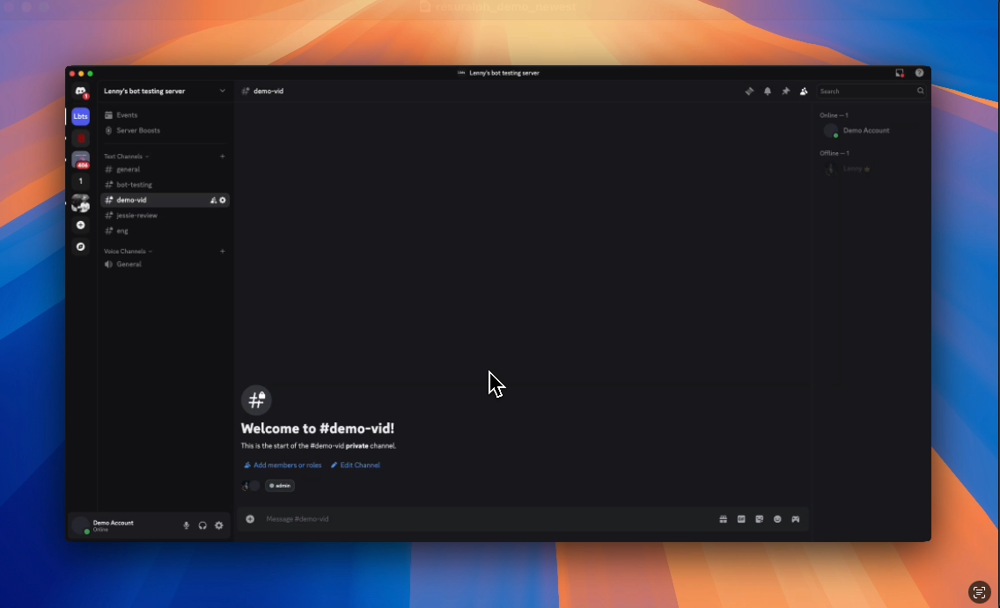

# **ResuRalph 🤖📄**

### A Discord bot for collaborative resume feedback

In today's competitive tech job market, a standout resume is the first step toward success. However, the resume review process can often be cumbersome.

- Long, overwhelming review threads, where comments can easily get buried and overlooked.
- Reviewers forced to download PDFs to view resume's and updated resume's, which becomes increasingly tedious with each incremental change.
- The frustration of manually identifying and specifying which parts of the resume you're referring to.
- Comparing two resume PDF's and trying to identify what changes were made by the user.

## **ResuRalph streamlines this process.**

## **Demo** 🎬

## **The Flow** ⏳

### **Initial Upload**

- Upload your resume as a PDF using the **/upload** command.
- ResuRalph validates the PDF, stores it in AWS S3, and saves metadata in DynamoDB.
- The bot generates a [Hypothes.is](https://hypothes.is/) annotation link for collaborative review and sends it back to the Discord thread.
- With this link, reviewers can leave **in-line** annotations directly on your resume.

### **Getting Feedback**

- Use **/get_annotations** to pull annotations from reviewers directly into Discord.
- Try **/ai_review** for AI-powered feedback and annotations (limited to once per day).
- View all your resume versions with **/get_all_resumes**.
- Get your latest resume link anytime with **/get_latest_resume**.

### **Updating & Comparing**

- Use **/update** to upload an improved version of your resume.
- Enable the **show_diff** option to see changes between versions:
  🟢**Added:** "Project X | React, Node, SQL..."
  🔴**Removed:** "Work Experience Y | Example Company..."
- Use **/get_resume_diff** to compare any two resume versions.
- **/clear_resumes** permanently removes all your data from the system.

---

## **Tech Stack** 🛠️

### **Backend Architecture**

- **Python 3.13** - Core application language
- **Flask + Mangum** - Web framework with AWS Lambda adapter
- **Discord Interactions** - Discord bot integration
- **Docker** - Containerized deployment

### **AWS Infrastructure**

- **AWS Lambda** - Serverless compute (ARM64 architecture)
  - Main Lambda: Discord interaction handler (10s timeout)
  - Command Processor Lambda: Async command processing (60s timeout)
- **Amazon S3** - PDF storage with public access
- **DynamoDB** - Resume metadata and user data storage
- **SQS** - Asynchronous command processing queue
- **CDK (TypeScript)** - Infrastructure as Code

---

### **A Challenge: Discord's 3-Second Limit**

Discord requires bot responses within 3 seconds, but operations like AI reviews and PDF-diff (for resume updates) can take 10-ish seconds. These approaches failed:

- **Background threads in Lambda**: Lambda terminates background threads when the main handler returns
- **Thread joining**: Blocks the response, violating the 3-second limit
- **Synchronous processing**: Times out and fails user interactions

#### **Solution: Deferred Response with SQS + Seperate Command Handler Lambda**

1. **Immediate Response** (< 3 seconds)

   - Main Lambda receives Discord interaction
   - Returns deferred response type (`"ResuRalph is thinking..."`)
   - Publishes command to SQS queue
   - Discord interaction completes successfully

2. **Asynchronous Processing**

   - Command Processor Lambda triggered by SQS message
   - Processes long-running operations (AI analysis, PDF diff processing)
   - Uses Discord's follow-up webhook to send results
   - Independent timeout and retry handling

3. **Error Handling & Reliability**
   - SQS provides built-in retry mechanisms
   - Dead letter queues for failed messages
   - Separate resource pools prevent blocking
   - Cost-optimized: only pay for actual processing time

This pattern is recommended by AWS for serverless asynchronous workflows, using SQS as the message broker between Lambda functions.
